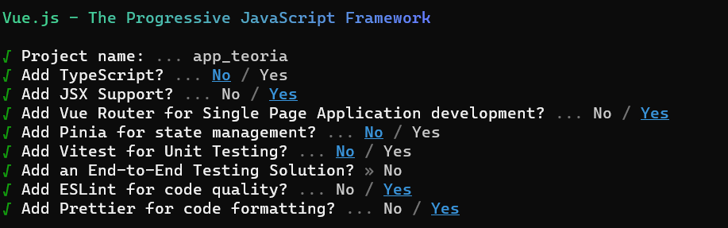

# Comandos
#### Iniciar proyecto

``` sh
npm init vue@latest 
```

#### Responder Si/No


#### Entrar al proyecto vue
``` sh
cd app_teoria
```
 
#### Instalar los paquetes
``` sh
npm install
```

#### Correr lint
``` sh
npm run lint
```

#### Correr proyecto vue
``` sh
npm run dev
```
